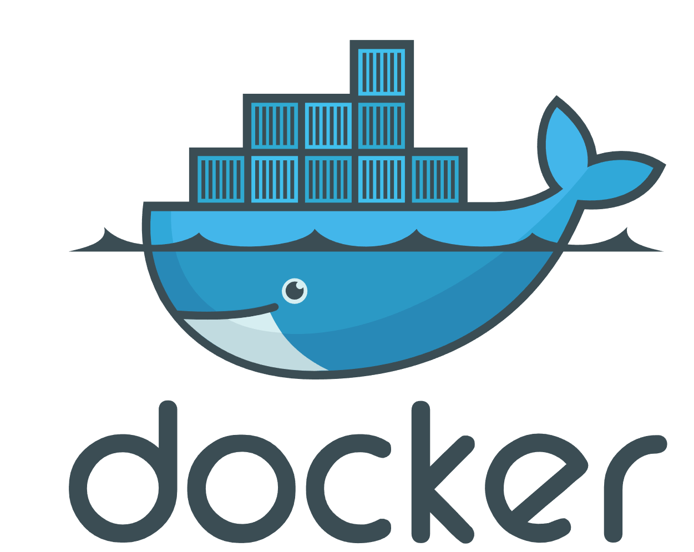

<h1 align="center">Всем привет! Я  <a href="https://anapa.hh.ru/resume/f19e9a84ff082844900039ed1f6973617a4731" target="_blank">Василий</a> и добро пожаловать!
</h1>

## О себе:
 - :technologist: С 2020 работаю ручным тестировщиком, за плечами 4 проекта. 
 - :construction_worker: Тестирую WEB и мобилки, пишу тестовую документацию и много взайимодействую с коллегами.
 - :green_book: Cейчас активно изучаю автоматизацию на Java.
 - :robot:  В Будущем хочуть стать Full-Stack QA Engineer.

 ### Инструменты:

  <code></code>
  <code></code>
  <code></code>
  <code></code>
  <code></code>
  <code></code>
  <code></code>
  <code></code>
  <code></code>
  <code></code>
  <code></code>
  <code></code>
  <code></code>
  <code></code>
  <code></code>
  <code></code>
  <code></code>
  <code></code>
  <code></code>

  
